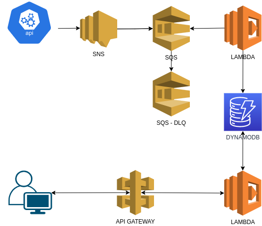

# CloudBanking

## Overview
Proof of concept to present some services provided by AWS.

Amazon Web Services (AWS) is a cloud service provider that offers IT infrastructure services to companies, which is popularly known as cloud computing. 
In theory, it allows you to reduce infrastructure costs and speed up the acquisition of hardware.

**Covered Services**

- [cloudformation](https://docs.aws.amazon.com/AWSCloudFormation/latest/UserGuide/Welcome.html)
- [sns](https://docs.aws.amazon.com/sns/latest/dg/welcome.html)
- [sqs](https://docs.aws.amazon.com/AWSSimpleQueueService/latest/SQSDeveloperGuide/welcome.html)
- [apigateway](https://docs.aws.amazon.com/apigateway/latest/developerguide/welcome.html)
- [lambda](https://docs.aws.amazon.com/lambda/latest/dg/welcome.html)
- [dynamodb](https://docs.aws.amazon.com/amazondynamodb/latest/developerguide/Introduction.html)


**Resources**



**Database**
```
Transaction: {
  user: string (pk)
  transaction_id: string (sk)
  date_time: decimal
  amount: decimal
  type: { TRANSFER_SENT, TRANSFER_RECEIVED, PURCHASE, PAYMENT, CANCELLED }
}
```

**References**

- https://aws.amazon.com/what-is-aws/
- https://docs.aws.amazon.com/index.html


## Use cases
- Save transaction
- Get transactions by user


## Requirements
- docker: https://www.docker.com/
- awscli: https://aws.amazon.com/cli/

## Setup

1. Run localstack

`docker run --rm -it -p 4566:4566 -p 4571:4571 localstack/localstack`

2. Create stack

`aws cloudformation validate-template --endpoint-url http://localhost:4566 --template-body file://cloudformation/bank.yml`

`aws cloudformation create-stack --endpoint-url http://localhost:4566 --stack-name bank --template-body file://cloudformation/bank.yml`

`aws cloudformation list-stack-resources --endpoint-url http://localhost:4566 --stack-name bank`

3. Update lambda save transactions

`(cd lambda-save-transaction && rm -f -r -- __pycache__ && rm -f -- lambda.zip && zip -r lambda.zip ./*)`

`aws lambda update-function-code --endpoint-url http://localhost:4566 --function-name SaveTransactionLambda --zip-file fileb://lambda-save-transaction/lambda.zip`


4. Update lambda get transactions by user

`(cd lambda-get-transactions-by-user && rm -f -r -- __pycache__ && rm -f -- lambda.zip && zip -r lambda.zip ./*)`

`aws lambda update-function-code --endpoint-url http://localhost:4566 --function-name GetTransactionsByUserLambda --zip-file fileb://lambda-get-transactions-by-user/lambda.zip`


## Running and testing

1. Save a transaction by publishing an event in the SaveTransactionTopic

`# aws sns publish --endpoint-url http://localhost:4566 --topic-arn "arn:aws:sns:us-east-1:000000000000:SaveTransactionTopic" --message '{"user":"john","amount":"999.99","type":"TRANSFER_SENT"}'`

2. Get rest api id

`aws apigateway get-rest-apis --endpoint-url http://localhost:4566`

3. Check saved transactions

`curl http://${rest_api_id}.execute-api.localhost.localstack.cloud:4566/dev/transactions`
